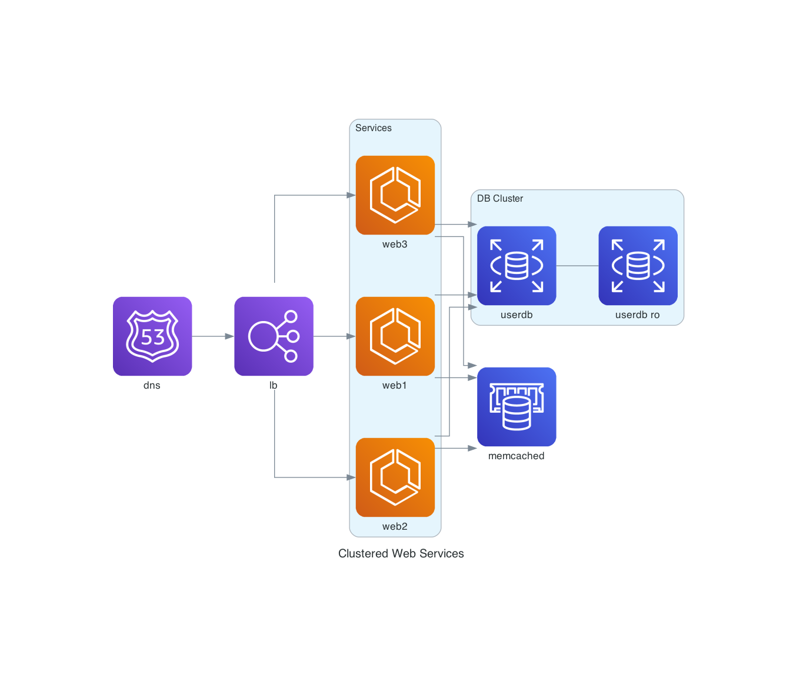
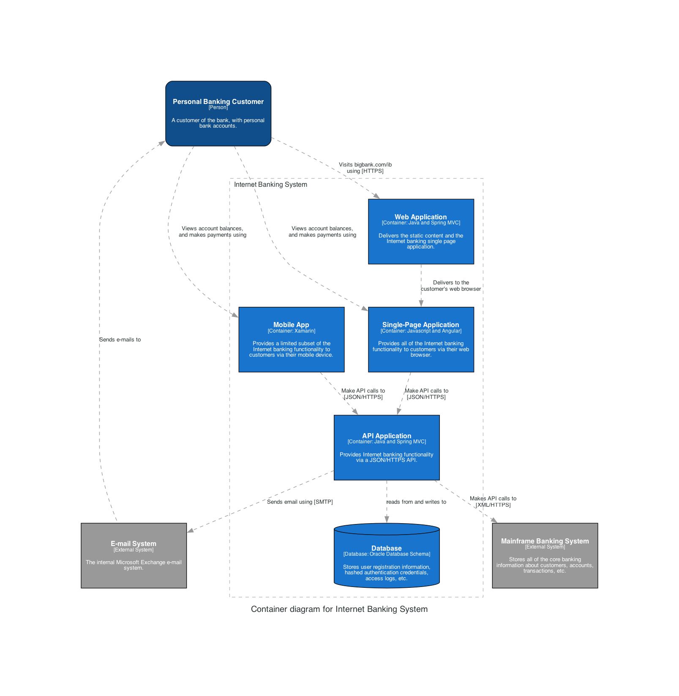

# Mingrammer Diagrams

The project is a playground to explore the Python [Diagrams](https://diagrams.mingrammer.com/) library.

## Prerequisites

Ensure the following requirements are met prior to usage:

- Python 3.12
- [Graphviz](https://graphviz.org/)

## Installation

Clone the repository:

```bash
git clone git@github.com:tgillus/mingrammer-diagrams.git
```

Change into the project directory:

```bash
cd mingrammer-diagrams
```

Create a Python virtual environment:

```bash
python3.12 -m venv env
```

Activate the virtual environment:

```bash
source env/bin/activate
```

Install dependencies:

```bash
pip install -r requirements.txt
```

## AWS Diagrams



## C4 Diagrams


